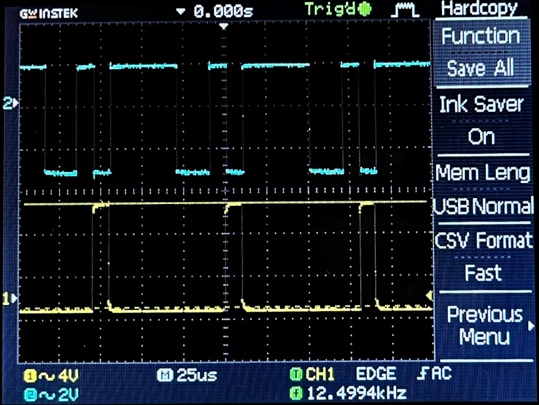
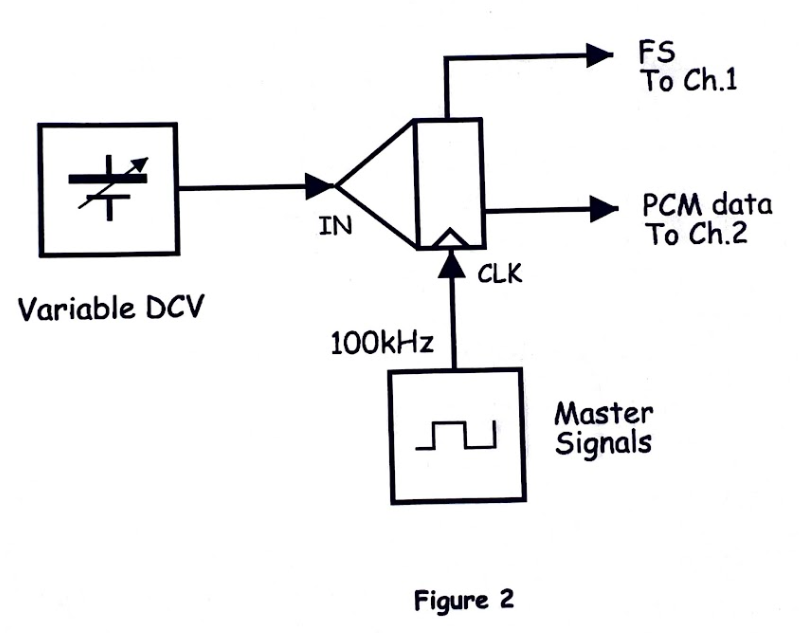
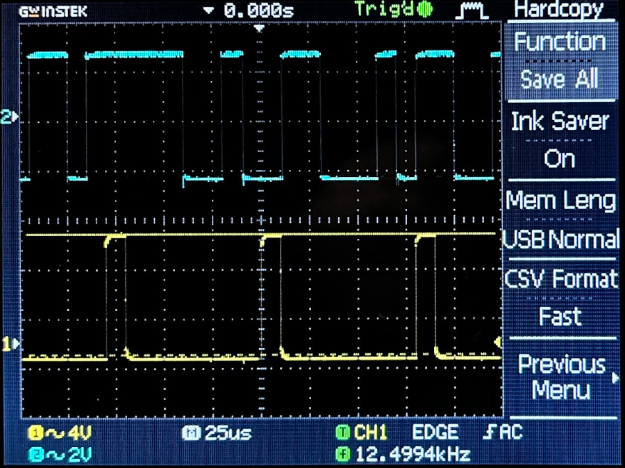
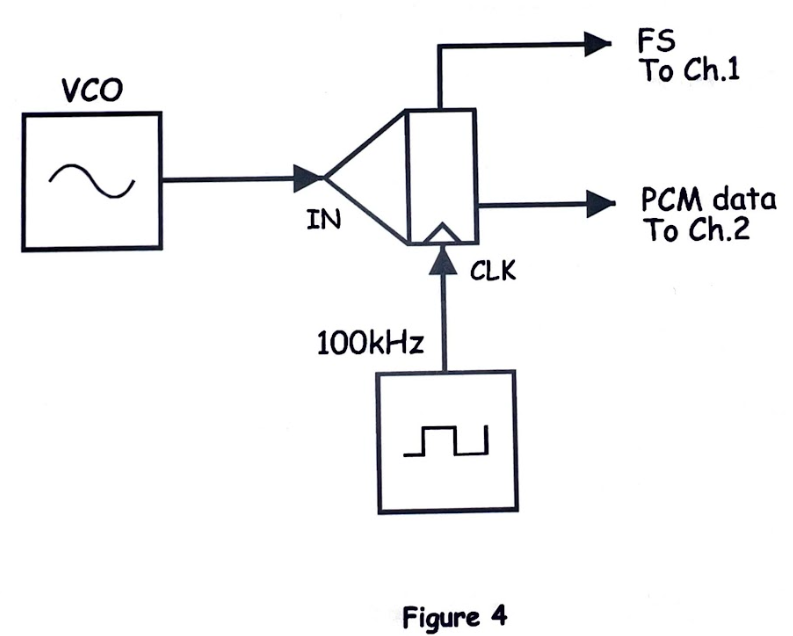
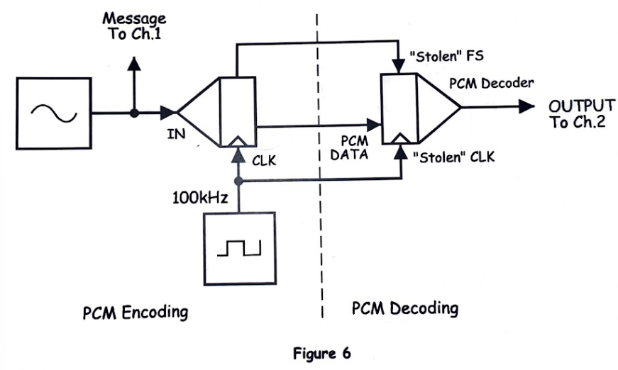
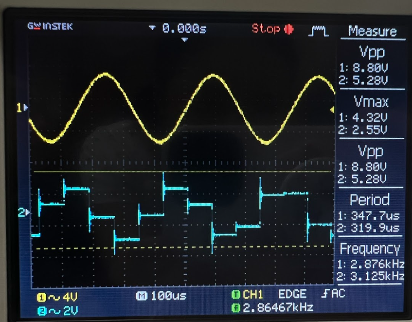
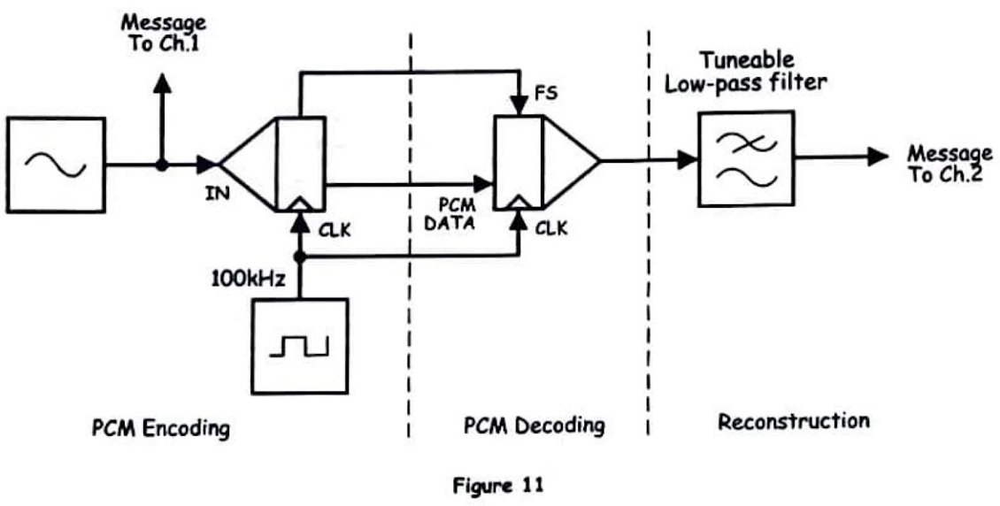
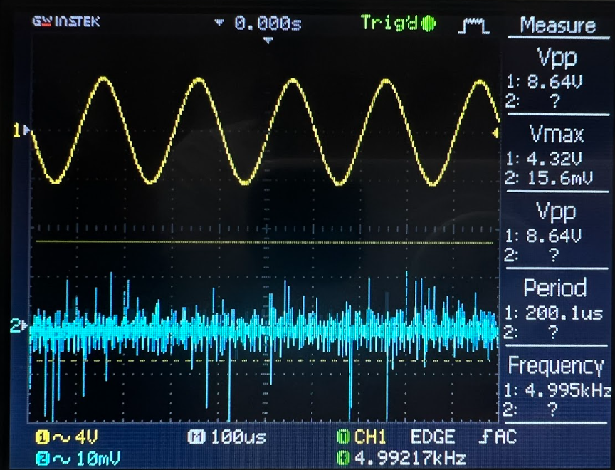

# EXPERIMENT 13 – PCM Decoding

## Objectives
The objective of this experiment is to study the process of Pulse Code Modulation (PCM) decoding and to understand how analog signals are converted into digital data and then reconstructed back into analog form. This experiment also demonstrates the complete communication process of encoding and decoding signals using the Emona Telecoms-Trainer 101. By observing the signals using an oscilloscope, students can better understand how digital communication systems represent and recover information.

---

# Materials
- Emona Telecoms-Trainer 101 (plus power pack)
- Dual-channel 20MHz oscilloscope
- Two Emona Telecoms-Trainer 101 oscilloscope leads
- Assorted Emona Telecoms-Trainer 101 patch leads
- One set of headphones (stereo)

---

# PART A: Setting up the PCM Encoder

## Procedure
In this part of the experiment, the PCM encoder is configured to convert an analog signal into a digital PCM signal. The encoder performs three essential processes: sampling, quantization, and encoding. The analog input signal is sampled at regular time intervals, and each sample is approximated to the nearest discrete amplitude level through quantization. The quantized values are then converted into binary numbers, forming the PCM data stream.

The output signals are observed on the oscilloscope to analyze how the encoder processes the input waveform and transforms it into digital data.

---

## Block Diagram

**Figure 1: Setting up PCM Encoder Block Diagram**

---

## Output Observation

**Figure 2: Output Signal from PCM Encoder**

---

**Figure 3: Output Observation**

The oscilloscope shows the encoded digital signal generated by the PCM encoder. The waveform consists of binary pulses representing the quantized samples of the original analog signal.

---

# PART B: Decoding the PCM Data

## Procedure
In this section, the PCM digital data generated by the encoder is sent to the PCM decoder module. The purpose of the decoder is to convert the binary PCM data back into an analog waveform. The decoder interprets the binary codes and reconstructs the corresponding amplitude levels.

However, the initial output from the decoder appears as a stepped waveform rather than a smooth signal. This occurs because the decoder reproduces the quantized sample levels instead of a continuous waveform.

---

## Video Output
VIDEO OUTPUT (FIGURE 5)

https://drive.google.com/file/d/1mrShJ6Cpv7Ws8kFbE_z4eQHtuTkdgkTF/view?usp=drive_link

---

## Block Diagram

**Figure 4: Decoding PCM Data Block Diagram**

---

## Output Observation

**Figure 5: Output Signal from PCM Decoder**

The observed output waveform from the decoder appears as a stepped signal. This stepped shape represents the discrete quantized levels used during the encoding process.

---

## Questions and Answers

### 1. What does the PCM Decoder’s “stepped” output tell you about the type of signal that it is?

The stepped output indicates that the signal is composed of discrete amplitude levels rather than a continuous waveform. This happens because the PCM system samples the analog signal and represents each sample using a quantized value. The decoder reconstructs these quantized levels exactly as they were encoded, resulting in a staircase-like waveform instead of a smooth analog signal.

This characteristic shows that PCM signals are digital representations of analog information. Each step corresponds to a specific quantization level that approximates the original analog amplitude.

---

### 2. What must be done to the PCM Decoder module’s output to reconstruct the message properly?

To properly reconstruct the original message signal, the output of the PCM decoder must pass through a **low-pass filter** or **reconstruction filter**. The purpose of this filter is to smooth out the stepped waveform by removing high-frequency components created during the sampling and quantization processes.

The low-pass filter interpolates between the sampled values and produces a continuous analog signal that closely resembles the original message waveform.

---

# PART C: Encoding & Decoding Speech

## Procedure
In this part of the experiment, a speech signal is used as the message input instead of a simple waveform. The speech signal is encoded using the PCM encoder and transmitted as a digital data stream. The PCM decoder then reconstructs the signal back into analog form.

By listening through the headphones, the reconstructed speech signal can be compared with the original speech input. Although the reconstructed speech is recognizable and understandable, some small distortions may be present due to quantization and sampling limitations.

---

## Video Output (Figure 9)

https://drive.google.com/file/d/1xK-QuH5vgo91uCbPqnko6MiyeHU3dzVx/view?usp=drive_link

---

# PART D: Recovering the Message

## Block Diagram

**Figure 6: PCM Encoding & Decoding Block Diagram**

---

## Output Observation

**Figure 7: Reconstructed Output Signal**

The final reconstructed waveform is observed at the output of the decoder after processing the PCM data. The signal closely resembles the original analog signal but may contain minor differences due to quantization errors and limited sampling resolution.

---

# Question and Answer

### Even though the two signals look and sound the same, why isn’t the reconstructed message a perfect copy of the original message?

The reconstructed signal is not a perfect copy of the original message because of several factors inherent in the PCM process. One of the main reasons is **quantization error**, which occurs when the continuous range of analog signal amplitudes is approximated into a limited number of discrete levels. This approximation introduces small differences between the original and reconstructed signals.

Another factor is the **sampling process**, where the signal is only measured at discrete time intervals rather than continuously. If the sampling rate or quantization resolution is limited, some information from the original signal may not be captured perfectly.

Additionally, noise and system imperfections in the communication modules may slightly affect the signal. Despite these limitations, PCM systems are highly effective because the reconstructed signal remains very close to the original and is usually indistinguishable to human hearing.
