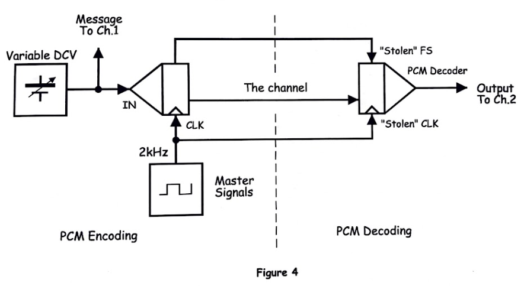
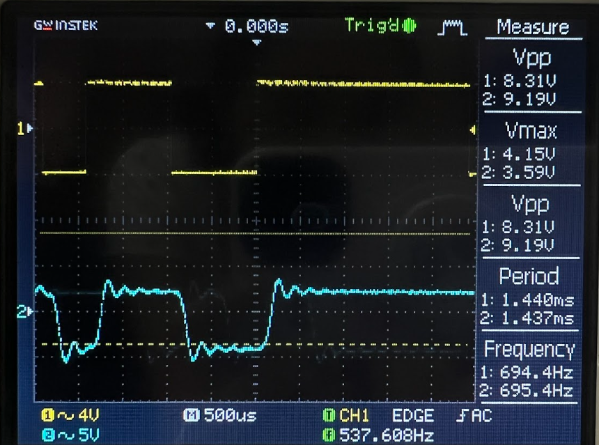
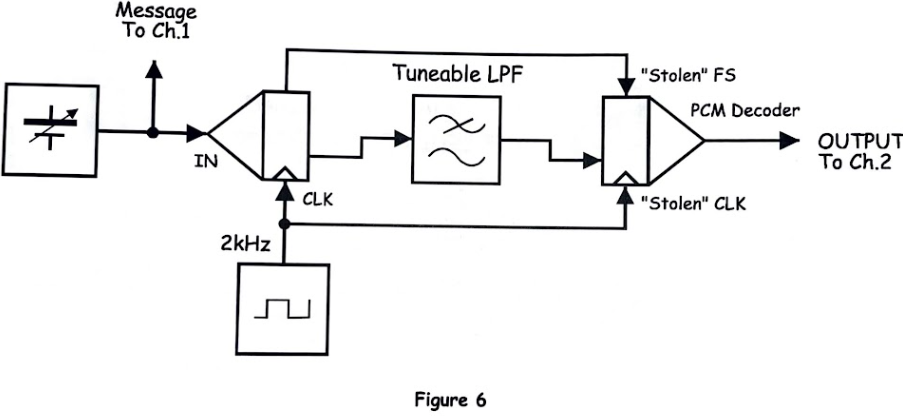
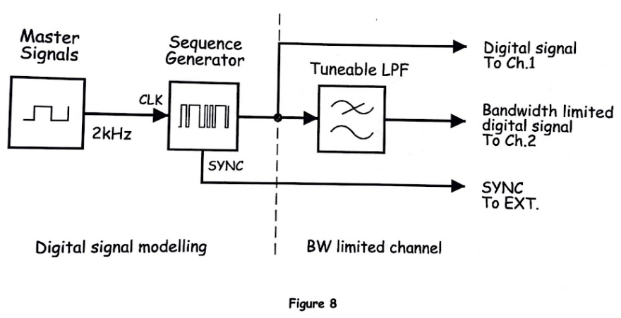
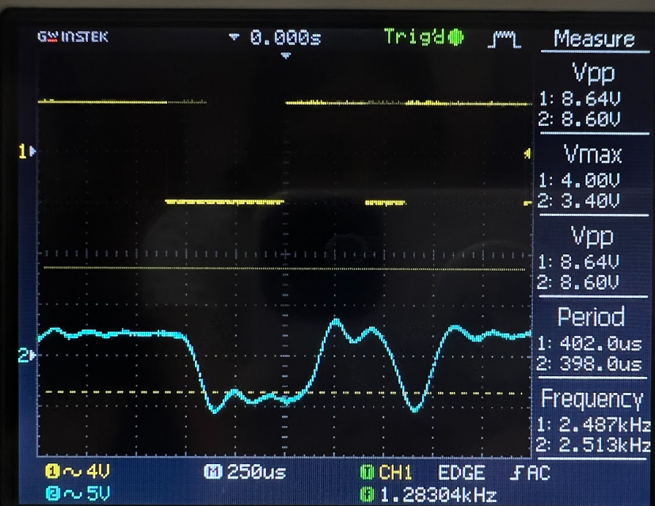
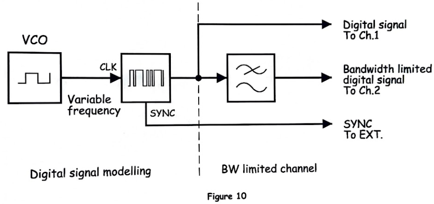
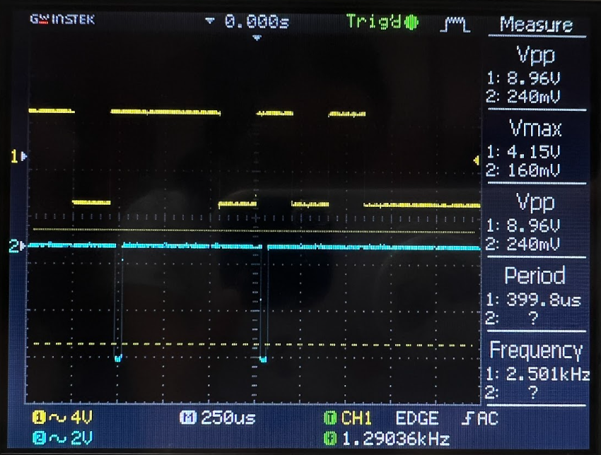
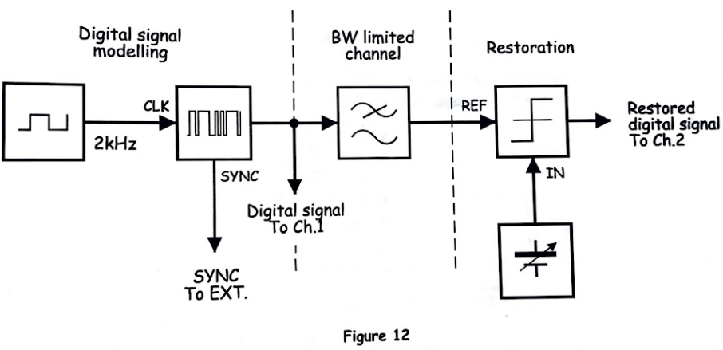

# EXPERIMENT 14 – Bandwidth Limiting and Restoring Digital Signals

## Objectives
This experiment investigates the effects of bandwidth limitation on digital signals, particularly in PCM systems, and demonstrates methods for restoring distorted signals. Students will observe how restricted bandwidth alters both the amplitude and waveform shape of digital signals and explore the practical limits of communication systems when signal transmission is constrained. The Emona Telecoms-Trainer 101 is used along with an oscilloscope to visualize the effects and solutions.

---

# Materials
- Emona Telecoms-Trainer 101 (plus-power pack)  
- Dual-channel 20MHz oscilloscope  
- Three Emona Telecoms-Trainer 101 oscilloscope leads  
- Assorted Emona Telecoms-Trainer 101 patch leads  
- One set of headphones (stereo)  

---

# PART A – Effects of Bandwidth Limiting on PCM Decoding

## Block Diagram

*Figure 1: Bandwidth limiting on the PCM Decoding block diagram.*

---

## Video Observation
**VIDEO OUTPUT (Figure 3)**  
https://drive.google.com/file/d/1tUrYp88yYrVIOuiLqSuPnAICUgts6Gl0/view?usp=drive_link

---

## Output Observation

*Figure 2: PCM Decoder output showing the effects of bandwidth limitation.*

---

## Tunable Low-Pass Filter Model

*Figure 3: Tunable Low Pass Filter module models bandwidth limiting of the channel.*

**VIDEO OUTPUT (Figure 5)**  
https://drive.google.com/file/d/1CzGDQ04Z8pEROBiYZZ3N1SRz3LAeyM0F/view?usp=drive_link

---

### Questions and Explanations

1. **Why does bandwidth limiting cause the PCM Decoder module to output incorrect voltages as well as correct ones?**  
   Bandwidth limitation acts like a low-pass filter, which removes high-frequency components of the digital signal. This can cause rounding errors in the reconstruction of the original PCM signal, producing incorrect voltage levels. High-frequency transitions, which define sharp edges in digital waveforms, are especially affected, leading to partial flattening or inaccurate amplitude readings.

2. **If this were a communication system transmitting speech, what would these errors sound like?**  
   The resulting speech may sound distorted or muffled because rapid transitions in the waveform (high-frequency components) are suppressed. Certain consonants or high-pitched sounds may be lost, reducing intelligibility or causing the message to sound unnatural.

---

# PART B – Effects of Bandwidth Limiting on Digital Signal Shape

## Digital Signal Modeling Block Diagram

*Figure 4: Digital signal modeling block diagram.*

---

## Output Observation

*Figure 5: Output showing digital signal deformation due to bandwidth limitation.*

---

### Questions and Explanations

1. **What two things are happening to cause the digital signal to change shape?**  
   - **Smoothing of sharp transitions:** High-frequency components are removed, rounding off the square waveform.  
   - **Signal delay or phase distortion:** Different frequency components are delayed unequally, causing slight misalignment of edges and flattening.

2. **What other system changes distort digital signals similarly to increasing bit rate?**  
   Increasing bit rate demands faster transitions in the signal. If the channel bandwidth is insufficient, the high-speed transitions cannot propagate correctly, resulting in the same waveform smoothing or distortion as caused by bandwidth limitation.

---

## Additional Output Observation

*Figure 6: Digital waveform distortion due to limited bandwidth.*

---

# PART C – Restoring Digital Signals

## Output Observation

*Figure 7: Recovered digital signal after bandwidth restoration.*

---

## Block Diagram

*Figure 8: Bandwidth restoration block diagram.*

---

### Questions and Explanations

1. **Although the restored digital signal is almost identical to the original, what differences remain?**  
   Minor rounding or small amplitude variations may persist due to residual filtering effects. These are typically insignificant but can be observed when comparing detailed signal edges.

2. **Can this difference be ignored? Why?**  
   Yes, for most practical purposes such as speech or standard digital communication. The remaining variations are within the acceptable tolerance and do not affect message comprehension or digital logic recognition.

3. **Why do some DC voltages cause the comparator to output incorrect information?**  
   Extreme DC levels may exceed the input range of the comparator, causing it to misinterpret the signal’s high or low states. This leads to logical errors in the output.

4. **Why does the comparator begin to output incorrect information when this control is turned far enough?**  
   When filter settings are extreme, or input amplitude is too low/high, the reconstructed waveform cannot fully reach the voltage thresholds required by the comparator. The comparator may then misclassify high or low states, producing erroneous outputs.

---

### Note
- When **Channel 1 is connected to the Tunable LPF input**, the LPF output produces a digital (square) waveform.  
- If the LPF output produces a sine wave due to bandwidth limitation, the waveform is already distorted, demonstrating the effect of bandwidth restriction on digital signals.  

---

# Conclusion
This experiment illustrated the critical relationship between **channel bandwidth** and the integrity of digital signals. Bandwidth limiting reduces the high-frequency content of digital waveforms, leading to distorted PCM output, smoothed edges, and possible errors in message reconstruction. Restoring bandwidth with tunable filters or appropriate signal processing helps recover the original signal, emphasizing the importance of channel design and filtering in digital communication systems.

---
