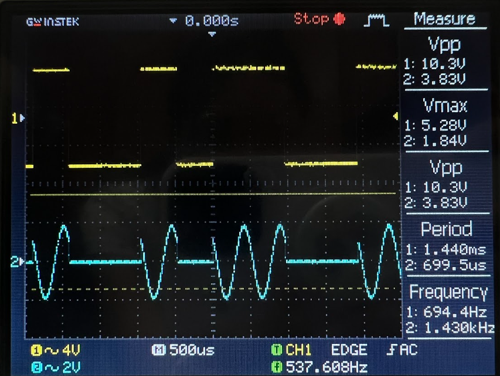
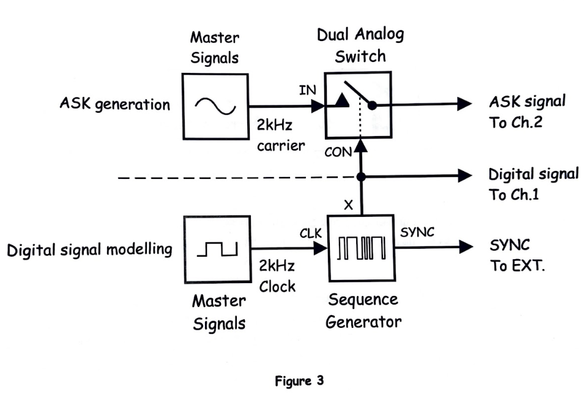
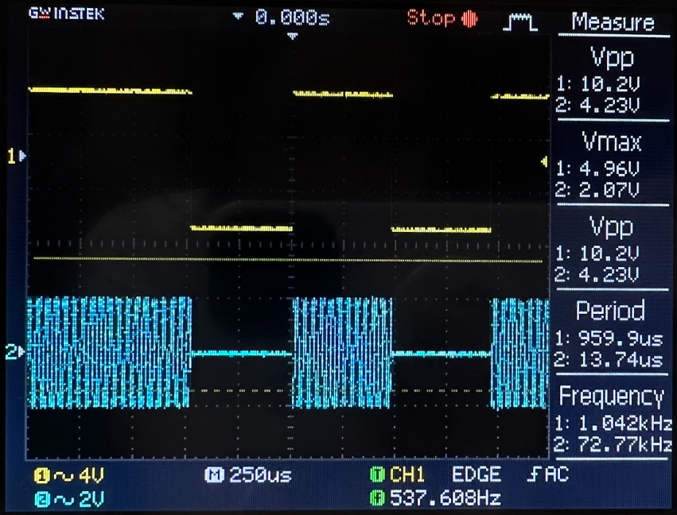
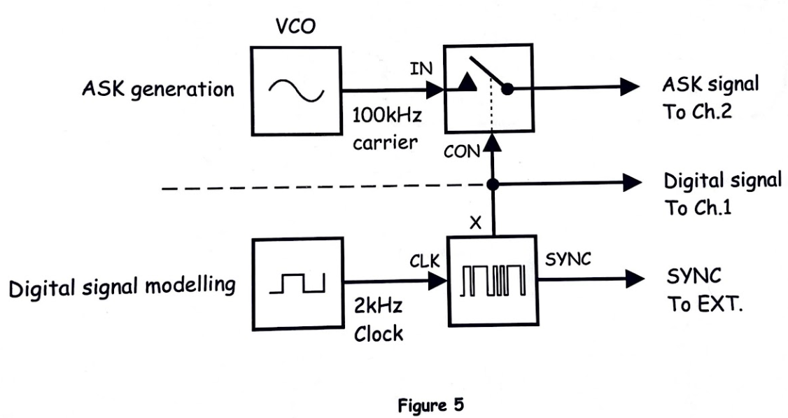
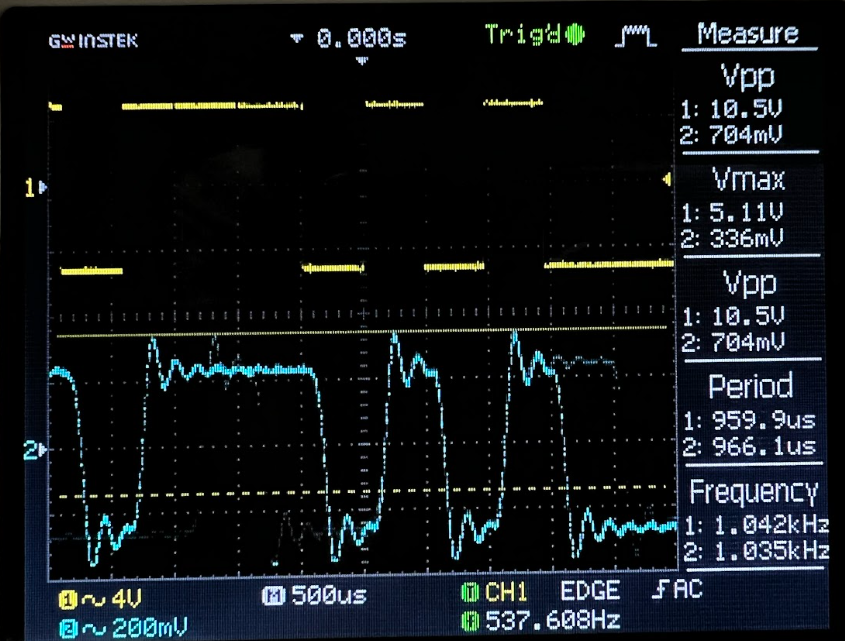
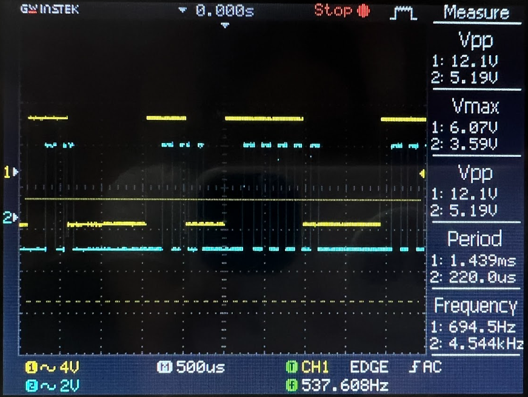
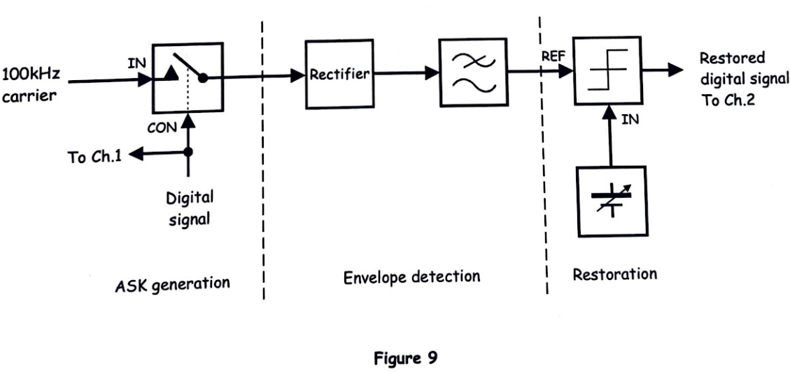

# EXPERIMENT 15 – Amplitude Shift Keying (ASK)

## Objectives
The objective of this experiment is to generate, observe, and analyze an Amplitude Shift Keying (ASK) signal using the Emona Telecoms-Trainer 101. Students will study how digital signals can modulate the amplitude of a carrier signal and explore methods for demodulating and restoring ASK signals using an envelope detector and a comparator. The oscilloscope is used to visualize the waveform changes at each stage.

---

# Materials
- Emona Telecoms-Trainer 101 (plus power pack)  
- Dual-channel 20MHz oscilloscope  
- Three Emona Telecoms-Trainer 101 oscilloscope leads  
- Assorted Emona Telecoms-Trainer 101 patch leads  

---

# PART A – Generating an ASK Signal

## Output Observation

*Figure 1: Output of ASK signal generation.*

---

## Block Diagram

*Figure 2: ASK Digital Signal Generator block diagram.*

---

## Output Observation

*Figure 3: ASK signal observed on oscilloscope.*

---

### Questions and Explanations

1. **What is the ASK signal’s voltage when the digital signal is logic-0?**  
   When the digital input is logic-0, the carrier is turned off (or reduced to a very low amplitude), producing a near-zero voltage output. This corresponds to the “off” state in ASK modulation.

2. **What feature of the ASK signal suggests that it’s an AM signal?**  
   The amplitude of the carrier varies according to the digital input signal. When the input is logic-1, the carrier is fully present; when the input is logic-0, the carrier is suppressed. This amplitude variation is characteristic of AM-based modulation.

---

# PART B – Demodulating the ASK Signal Using an Envelope Detector

## Block Diagram

*Figure 4: Envelope detector used for ASK demodulation.*

---

## Output Observation

*Figure 5: Output after envelope detection.*

---

### Questions and Explanations

1. **Why is the recovered digital signal not a perfect copy of the original?**  
   The envelope detector produces a smoothed version of the modulated waveform. The signal rises and falls gradually due to the filter components, so the recovered waveform has slower transitions compared to the original sharp digital edges.

2. **What can be used to “clean up” the recovered digital signal?**  
   A **comparator** can be used to restore sharp edges by converting slow-rising or rounded voltage transitions into fast logic-level changes. This removes the analog smoothing effects and reconstructs a clean digital waveform.

---

# PART C – Restoring the Recovered Digital Signal Using a Comparator

## Output Observation

*Figure 6: Output after comparator restoration.*

---

## Block Diagram

*Figure 7: Comparator used to restore the ASK signal.*

---

### Question and Explanation

**How does the comparator turn the slow-rising voltages of the recovered digital signal into sharp transitions?**  
The comparator compares the input voltage to a reference threshold. When the input rises above the threshold, the output switches instantly to a high logic level; when it falls below the threshold, the output switches instantly to a low logic level. This effectively converts the slowly varying envelope into a crisp digital waveform, restoring the original timing and logic of the transmitted digital signal.

---

# Conclusion
This experiment demonstrates the generation, demodulation, and restoration of ASK signals. Students learned how a digital message can modulate the amplitude of a carrier, how envelope detection recovers the signal, and how a comparator can restore the clean digital waveform. Understanding these processes is fundamental for studying digital modulation schemes and designing reliable communication systems.
