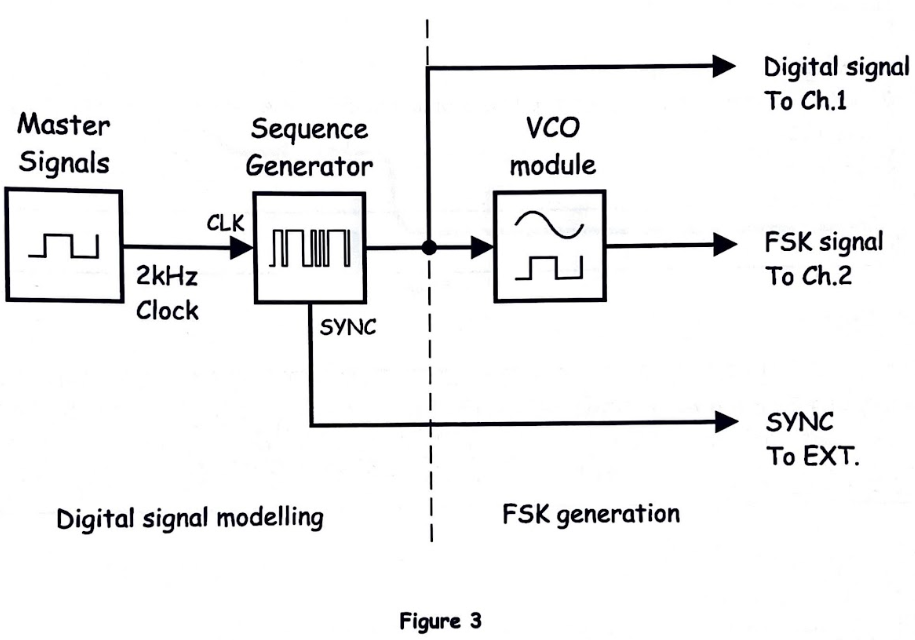
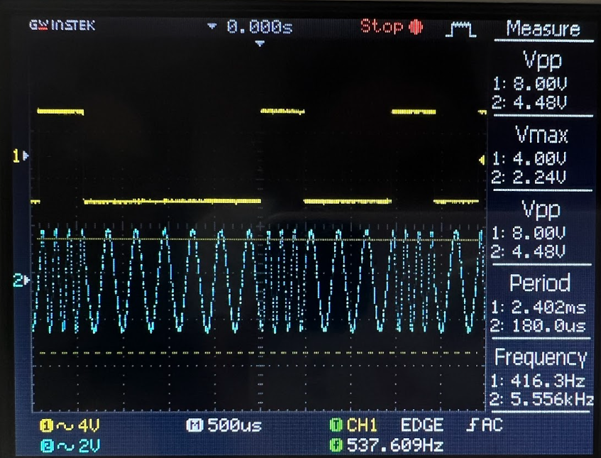
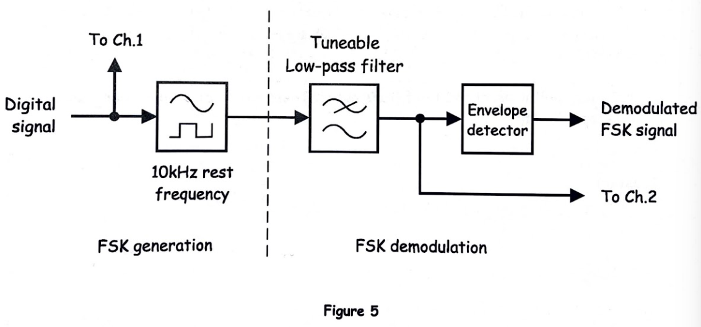
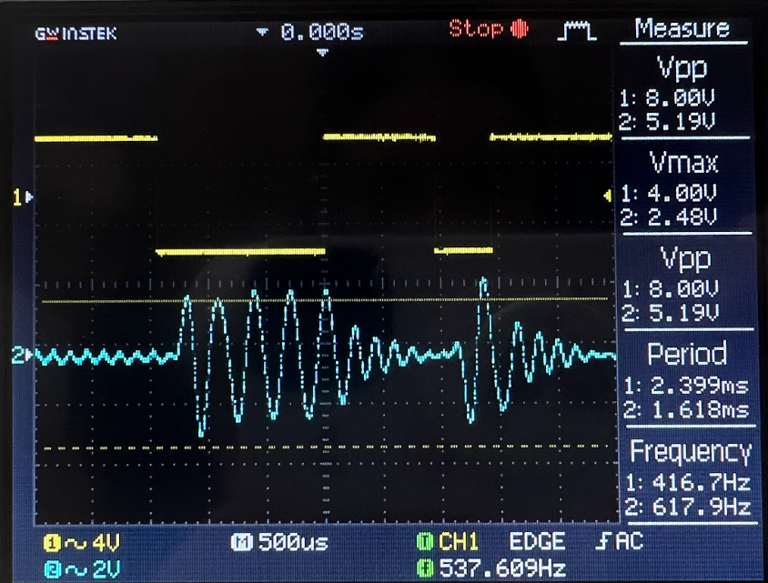
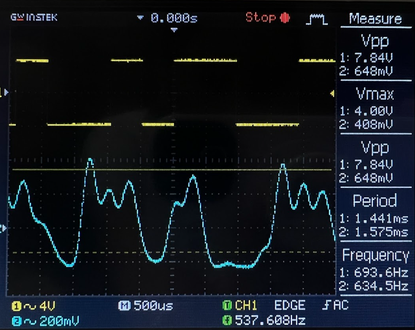
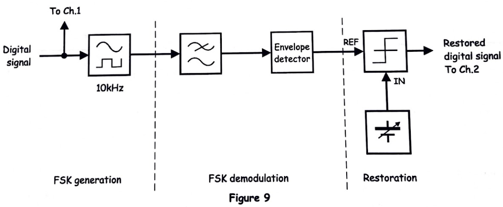
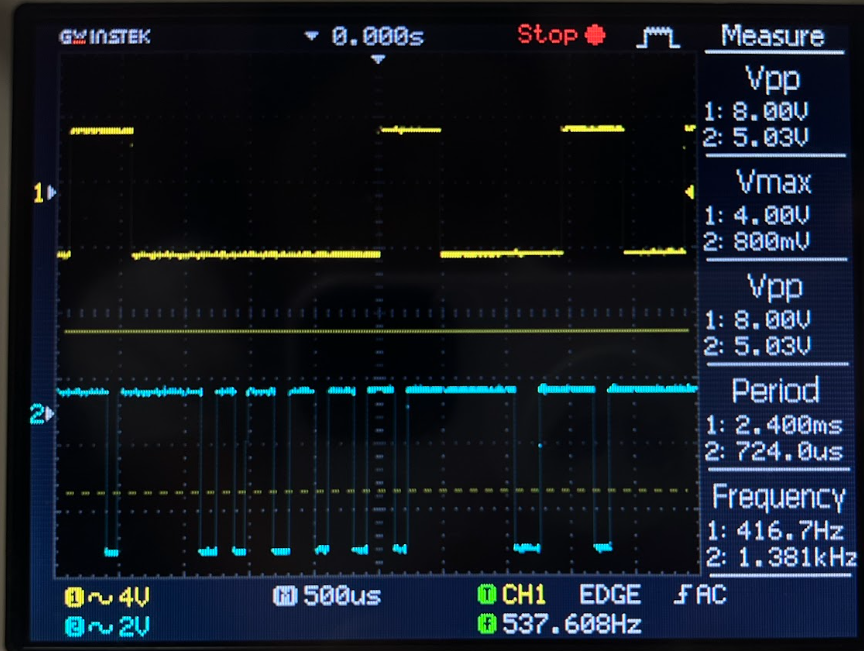

# EXPERIMENT 16 – Frequency Shift Keying (FSK)

## Objectives
This experiment demonstrates the generation, demodulation, and restoration of a Frequency Shift Keying (FSK) signal using the Emona Telecoms-Trainer 101. Students will observe how digital data modulates the frequency of a carrier signal, learn how to recover the original data using filtering and envelope detection, and restore sharp digital transitions using a comparator. The oscilloscope is used to visualize both the modulated signal and the recovered waveform.

---

# Equipment
- Emona Telecoms-Trainer 101 (plus-power pack)  
- Dual-channel 20MHz oscilloscope  
- Three Emona Telecoms-Trainer 101 oscilloscope leads  
- Assorted Emona Telecoms-Trainer 101 patch leads  

---

# PART A – Generating an FSK Signal

## FSK Signal Generator Block Diagram

*Figure 1: FSK Signal Generator block diagram.*

---

## Output Observation

*Figure 2: FSK signal observed on the oscilloscope.*

---

### Questions and Explanations

1. **What is the name for the VCO output frequency corresponding to logic-1s?**  
   The **mark frequency (f₁)** represents the VCO output when the digital input is logic-1.

2. **What is the name for the VCO output frequency corresponding to logic-0s?**  
   The **space frequency (f₀)** represents the VCO output when the digital input is logic-0.

3. **Based on your observation, which of the two is the higher frequency? Explain.**  
   Typically, the mark frequency (logic-1) is higher than the space frequency (logic-0). This is because the VCO is designed such that logic-1 increases the control voltage, producing a higher output frequency. The visual FSK waveform on the oscilloscope clearly shows faster oscillations during logic-1 periods.

---

# PART B – Demodulating the FSK Signal Using Filtering and an Envelope Detector

## FSK Signal Demodulator Block Diagram

*Figure 3: Demodulation of FSK using filter and envelope detection.*

---

## Output Observations
  

*Figure 4: Output after filtering and envelope detection.*

---

### Questions and Explanations

1. **Which of the FSK signal’s two sinewaves is the filter picking out?**  
   The filter selects either the **mark (logic-1) or space (logic-0)** frequency depending on the configuration, isolating one of the two frequencies to produce a smooth waveform for further detection.

2. **What does the filtered FSK signal look like?**  
   The filtered signal resembles the **envelope of the selected frequency**, showing smooth high and low voltage levels corresponding to the original digital data.

3. **What can be used to “clean-up” the recovered digital signal?**  
   A **comparator** converts the smoothed voltage levels into sharp digital transitions, restoring the original binary data accurately.

---

# PART C – Restoring the Recovered Data Using a Comparator

## Data Restoration Block Diagram

*Figure 5: Comparator block used to restore digital transitions.*

---

## Output Observation

*Figure 6: Restored FSK digital signal after comparator.*

---

### Question and Explanation

**How does the comparator turn the slow-rising voltage of the recovered digital signal into sharp transitions?**  
The comparator compares the incoming signal to a threshold voltage. When the signal rises above the threshold, the output instantly switches to a high logic level; when it falls below the threshold, it switches to a low logic level. This process converts the gradual voltage transitions into crisp digital signals, fully restoring the original digital data timing.

---

# Conclusion
This experiment highlights the principles of Frequency Shift Keying as a digital modulation scheme. Students learned how digital data can modulate carrier frequency, how envelope detection and filtering recover the signal, and how a comparator restores sharp transitions. These processes are foundational for understanding digital communication systems such as FSK-based telemetry and modem systems.
