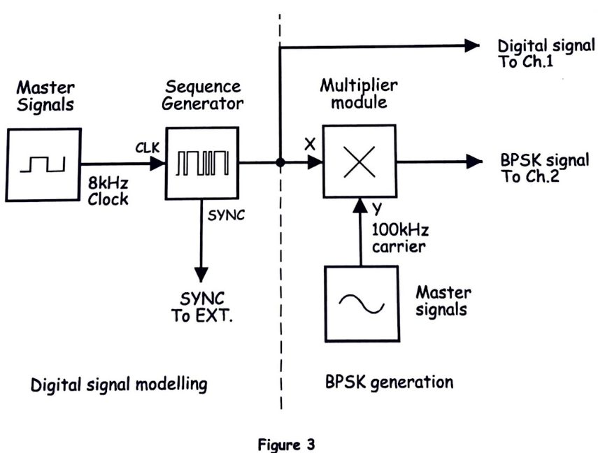
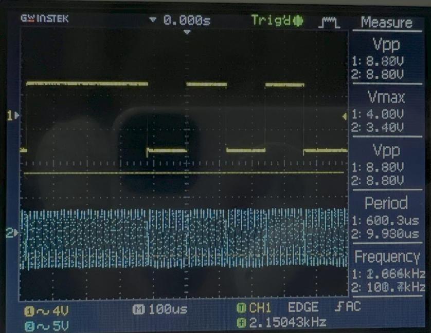
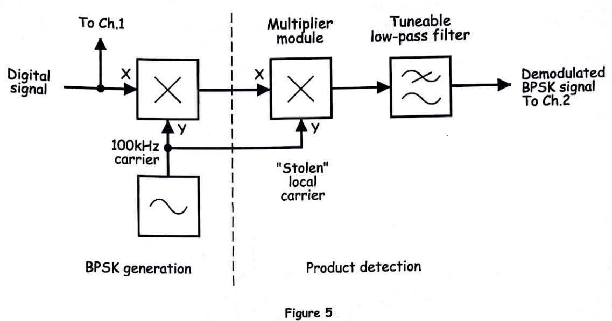
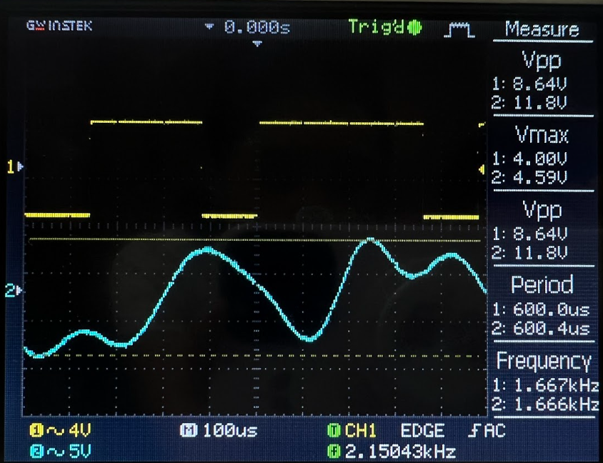
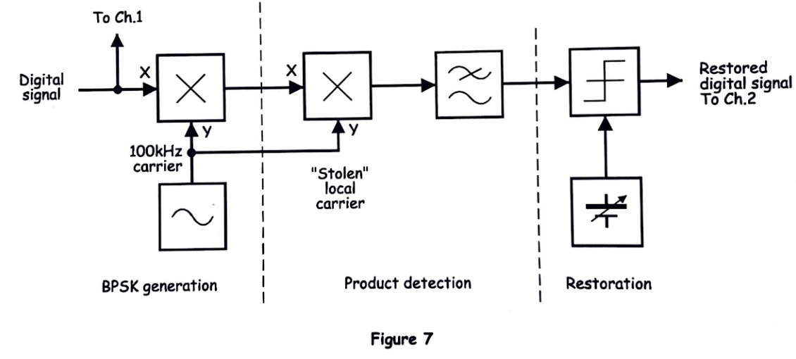
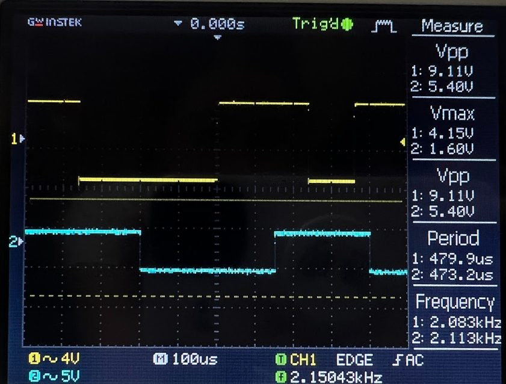

# EXPERIMENT 17 – Binary Phase Shift Keying (BPSK)

## Objectives
This experiment demonstrates the generation, demodulation, and restoration of a Binary Phase Shift Keying (BPSK) signal using the Emona Telecoms-Trainer 101. Students will explore how digital data modulates the **phase** of a carrier signal, how to recover the original data using a product detector, and how a comparator restores sharp digital transitions. Oscilloscope observations help visualize phase changes, demodulated outputs, and signal restoration.

---

# Equipment
- Emona Telecoms-Trainer 101 (plus-power pack)  
- Dual-channel 20MHz oscilloscope  
- Three Emona Telecoms-Trainer 101 oscilloscope leads  
- Assorted Emona Telecoms-Trainer 101 patch leads  

---

# PART A – Generating a BPSK Signal

## BPSK Signal Generator Block Diagram

*Figure 1: BPSK Signal Generator block diagram.*

---

## Output Observation

*Figure 2: BPSK signal observed on the oscilloscope.*

---

### Questions and Explanations

1. **What happens to the BPSK signal on the data stream’s logic transition?**  
   At each logic transition (from 0 → 1 or 1 → 0), the BPSK signal **undergoes a 180° phase shift**. This phase inversion encodes the digital data on the carrier.

2. **What feature of the BPSK signal suggests that it’s a DSBSC signal?**  
   The BPSK waveform has **no carrier component when phase shifts occur**, similar to a **Double Sideband Suppressed Carrier (DSBSC)** signal. Only the phase changes carry the information, while amplitude remains constant.

---

# PART B – Demodulating a BPSK Signal Using a Product Detector

## Product Detector Block Diagram

*Figure 3: Demodulating BPSK using a product detector.*

---

## Output Observation

*Figure 4: Recovered BPSK signal observed on the oscilloscope.*

---

### Questions and Explanations

1. **Why is the recovered digital signal not a perfect copy of the original?**  
   The recovered signal may have **rounded transitions and slight timing errors** due to filtering, phase misalignment, or small delays in the demodulation process.

2. **What can be used to “clean up” the recovered signal?**  
   A **comparator** can restore sharp transitions, converting the smoothed or distorted signal into clean logic-level digital pulses.

---

# PART C – Restoring the Recovered Data Using a Comparator

## Comparator Block Diagram

*Figure 5: Comparator used to restore BPSK digital signal.*

---

## Output Observation

*Figure 6: Restored BPSK digital signal.*

---

### Question and Explanation

**Why does varying the DC voltage on the comparator’s input change the shape of the digital signal?**  
The comparator determines the threshold voltage at which the input signal switches between logic low and high. Adjusting the DC level changes when the output transitions occur, affecting **rise time, pulse width, and overall waveform shape**. Proper threshold adjustment ensures clean, accurate digital restoration of the BPSK data.

---

# Conclusion
This experiment illustrates the principles of **BPSK modulation and demodulation**. Students learned:  
- Digital data modulates the **phase** of a carrier signal.  
- Phase shifts encode binary information similar to a DSBSC signal.  
- A product detector recovers the data, and a comparator restores sharp digital transitions.  

Understanding BPSK is fundamental for modern digital communication systems such as **satellite communications, PSK modems, and digital RF links**.
