# EXPERIMENT 18 – Quadrature Phase Shift Keying (QPSK)

## Objectives
This experiment explores the **generation, modulation, and demodulation** of a Quadrature Phase Shift Keying (QPSK) signal using the Emona Telecoms-Trainer 101. The goal is to understand how two digital bit streams modulate carrier signals in quadrature, observe the combined QPSK waveform, and use phase discrimination to isolate individual components.

QPSK encodes **two bits per symbol** by shifting the phase of a carrier among four discrete values (0°, 90°, 180°, 270°), effectively combining two BPSK signals (I and Q channels) for efficient bandwidth utilization.

---

# Equipment
- Emona Telecoms-Trainer 101 (plus-power pack)  
- Dual-channel 20 MHz oscilloscope  
- Three Emona Telecoms-Trainer 101 oscilloscope leads  
- Assorted Emona Telecoms-Trainer 101 patch leads  

---

# PART A – Generating a QPSK Signal

### Mathematical Implementation Block Diagram
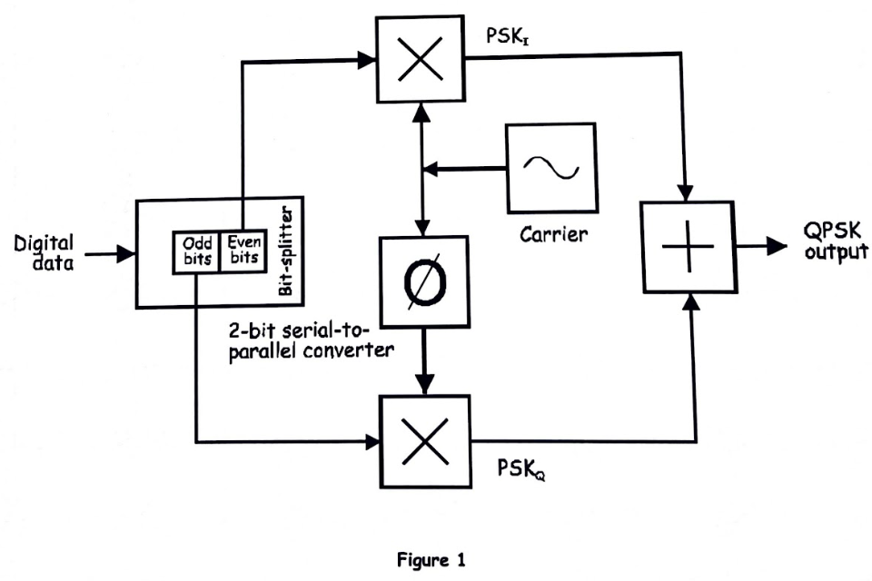  
*Figure 1: QPSK mathematical implementation.*

### Demodulation Block Diagram
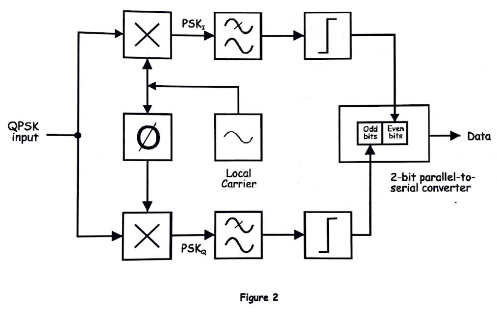  
*Figure 2: QPSK demodulation setup.*

### Output Observation
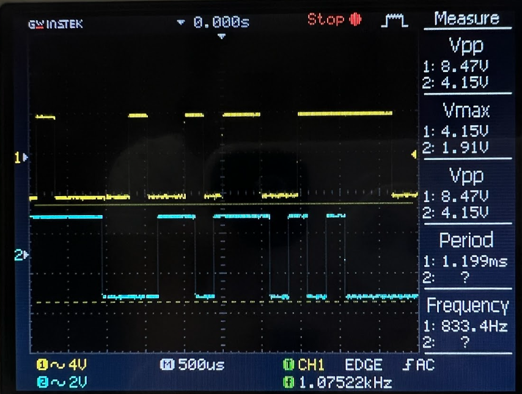  
*Figure 3: QPSK waveform observed on the oscilloscope.*

---

## Modeling Data Using a Sequence Generator

### Block Diagram
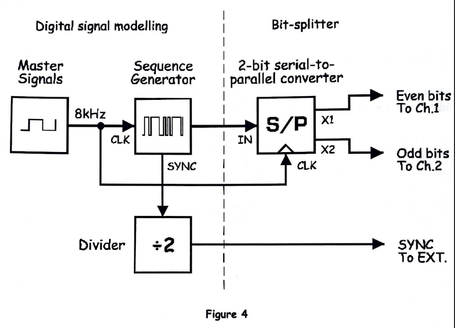  
*Figure 4: Modeling digital data using a sequence generator.*

**Question:**  
*What is the relationship between the bit rate of the two digital signals and the bit rate of the Sequence Generator output?*  

**Answer:**  
Each digital input bit stream represents **one half of the QPSK symbol**. The Sequence Generator combines them into a symbol stream where **each symbol carries two bits**, effectively halving the symbol rate compared to the bit rate of each individual input stream.

---

## Multiplier Output – BPSK Signals

### Block Diagram
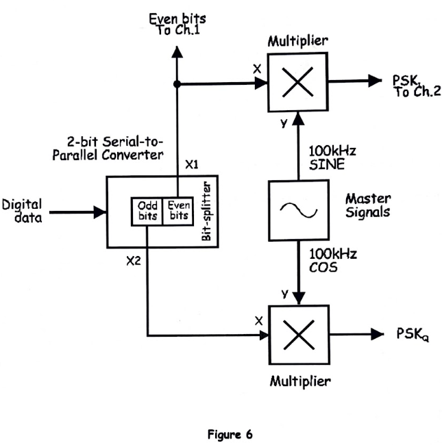  

### Output Observation
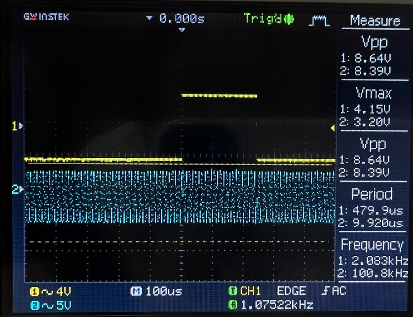  

**Question:**  
*What feature of the Multiplier’s output suggests that it’s a BPSK signal?*  

**Answer:**  
The output exhibits **180° phase shifts** corresponding to each input bit, characteristic of BPSK modulation.

---

### Multiplier Output – PSKi and PSKq

#### Block Diagram
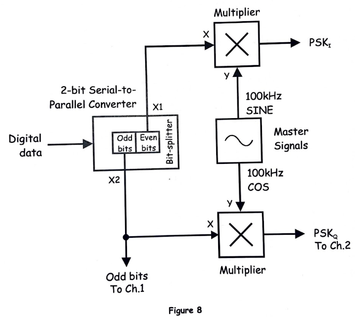  

#### Output Observation
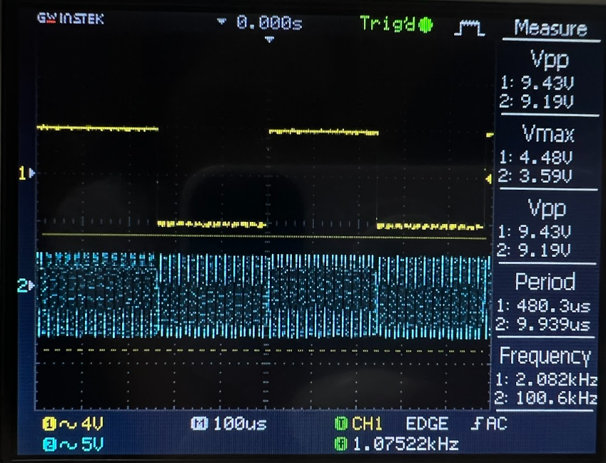  

**Question:**  
*What type of signal is present on the Multiplier’s output?*  

**Answer:**  
The output is a **BPSK-modulated carrier**, representing either the in-phase (I) or quadrature (Q) component of the QPSK signal.

---

## Adder Output – Combined QPSK Signal

### Block Diagram
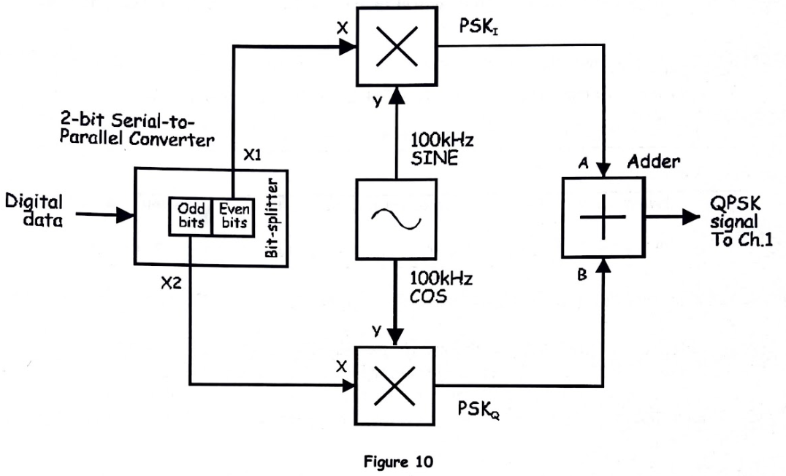  

### Output Observation
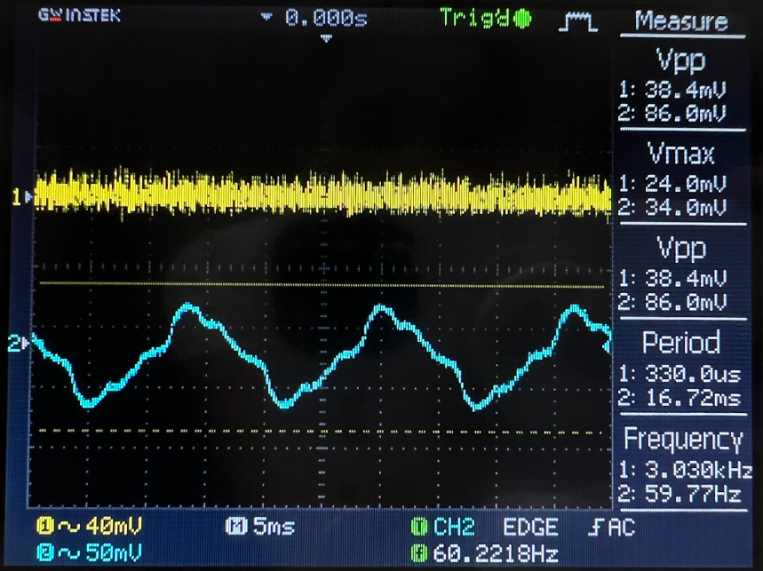  

**Questions:**  
1. *According to theory, what type of digital signal transmission is now present on the Adder’s output?*  
   **Answer:** The output is a **full QPSK-modulated signal**, combining PSKi and PSKq channels into a single waveform.  

2. *Why is there only one sine wave when the QPSK signal is made up of two BPSK signals?*  
   **Answer:** The single waveform represents the **combined effect of the I and Q channels**; each symbol encodes two bits as a **phase shift in a single carrier** rather than separate waveforms.

---

# PART B – Using Phase Discrimination to Pick Out QPSK Signals

### Phase Discrimination Block Diagram
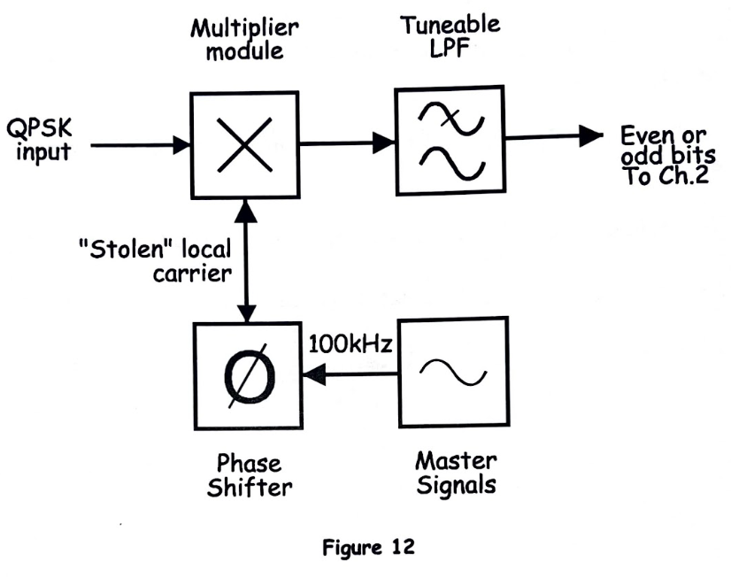  

**Question:**  
*What causes the 3- and 4-level signals out of the Tunable LPF during phase adjustments? How many Phase Adjust control positions produce a bipolar signal?*  

**Answer:**  
Intermediate phase alignments cause multiple levels. Only **specific Phase Adjust positions** align the local oscillator with the input carrier to generate a **clean bipolar output**.

---

### Local Carrier Phase Relationships

#### Block Diagram
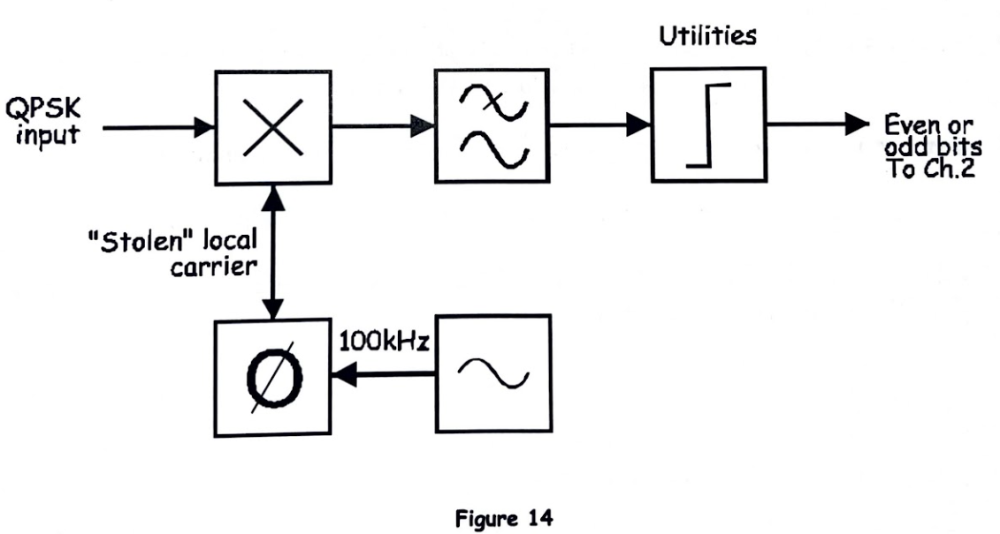  

**Questions and Answers:**  
1. *What is the present phase relationship between the local carrier and the PSKi & PSKq carriers?*  
   **Answer:** The local carrier is aligned with PSKi and **90° out of phase with PSKq** to allow proper quadrature demodulation.  

2. *What is the new phase relationship after adjustment?*  
   **Answer:** Adjusting phase allows selection of PSKq instead of PSKi, isolating one channel at a time.  

3. *Why is this demodulator considered only half of a full QPSK receiver?*  
   **Answer:** It demodulates only **one channel (I or Q)**. A full QPSK receiver requires **both channels** to reconstruct the full 2-bit-per-symbol data stream.

---

# Conclusion
- QPSK combines two BPSK signals (I and Q) to transmit **two bits per symbol**, doubling spectral efficiency.  
- Phase discrimination allows extraction of either the I or Q channel.  
- Proper phase alignment and understanding of quadrature detection are crucial for **digital communication systems** like LTE, Wi-Fi, and satellite links.
