# EXPERIMENT 19 – Direct Sequence Spread Spectrum (DSSS) Modulation and Demodulation

## Objectives
This experiment demonstrates **Direct Sequence Spread Spectrum (DSSS)** using the Emona Telecoms-Trainer 101. DSSS spreads a narrowband message signal over a wider bandwidth using a **pseudo-noise (PN) code**, improving resistance to interference and jamming. Students will generate DSSS signals using simple messages and speech, recover the original message with a product detector, and observe the effects of deliberate interference.

---

# Equipment
- Emona Telecoms-Trainer 101 (plus-power pack)  
- Dual-channel 20 MHz oscilloscope  
- Two Emona Telecoms-Trainer 101 oscilloscope leads  
- Assorted Emona Telecoms-Trainer 101 patch leads  

---

# PART A – Generating a DSSS Signal Using a Simple Message

### DSSS Signal Generation Block Diagram
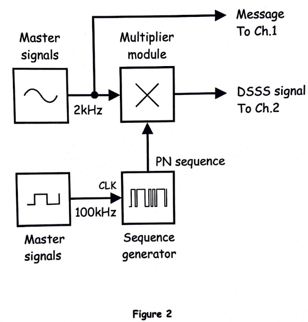  
*Figure 1: DSSS generation using a simple message.*

### Output Observation
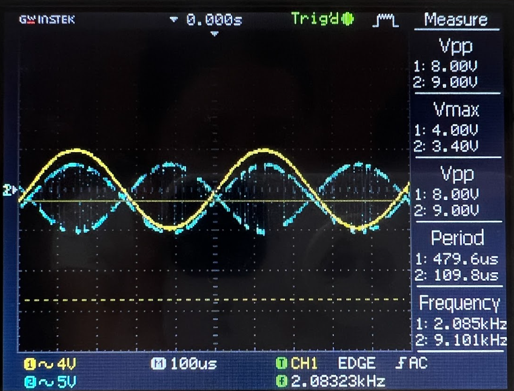  
*Figure 2: DSSS waveform on the oscilloscope.*

**Questions:**  
1. *What feature of the Multiplier module’s output suggests that it’s basically a DSBSC signal?*  
   **Answer:** The output has the **double-sideband suppressed carrier (DSBSC)** shape, showing the message modulated onto a carrier without a strong carrier component.  

2. *Why is the DSSS signal so large when it’s supposed to be small and indistinguishable from noise?*  
   **Answer:** DSSS spreads the message over a wide bandwidth using the PN code. On the oscilloscope, the amplitude appears large due to the **high-frequency pseudo-noise modulation**, even though the signal power relative to noise is low.

---

# PART B – Generating a DSSS Signal Using Speech

### Output Observation
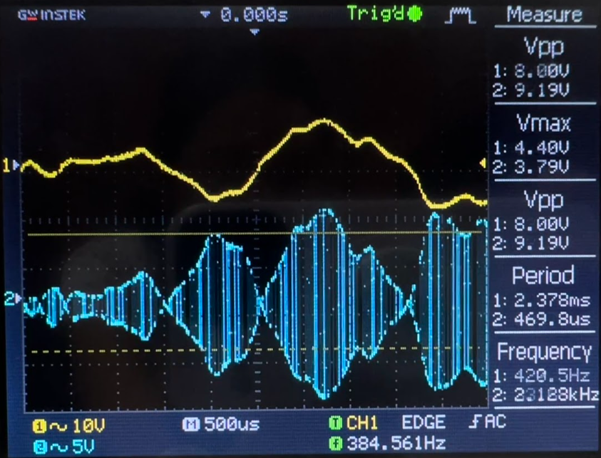  

**Questions:**  
1. *Why isn’t there any signal out of the DSSS modulator when you’re not talking?*  
   **Answer:** DSSS modulates the **input signal**, so when no speech is present, there’s no message to spread, resulting in zero output.

---

# PART C – Using the Product Detector to Recover the Message

### Message Recovery Block Diagram
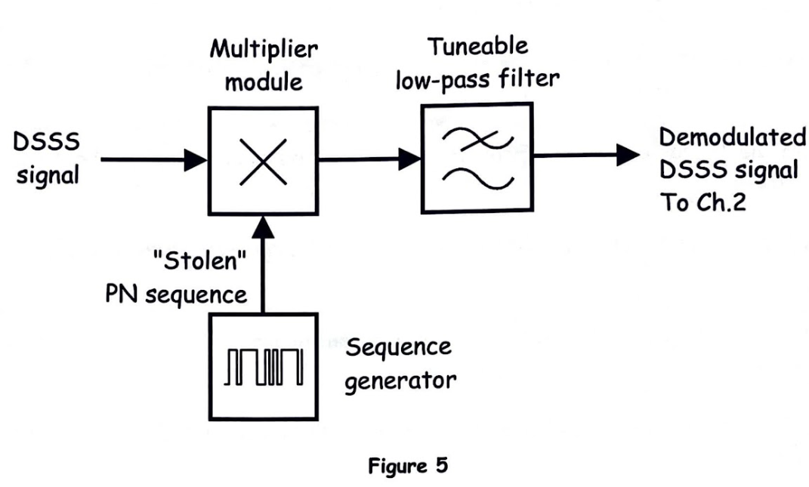  
*Figure 3: Recovering the DSSS message with a product detector.*

### Output Observation
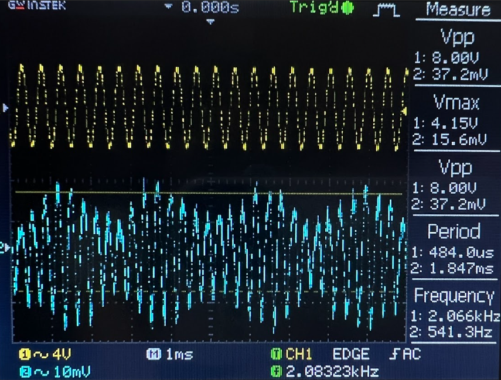  

**Questions:**  
1. *What does the signal out of the low-pass filter look like?*  
   **Answer:** It reconstructs the original message waveform (speech or simple message), removing the high-frequency PN carrier components.  

2. *Why does using the wrong PN sequence for the local carrier cause the product detector’s output to look like this?*  
   **Answer:** If the PN sequence doesn’t match the transmitted code, the despreading fails, producing **a distorted or unintelligible signal**, as the correlation with the original signal is lost.

---

### DSSS Output – Additional Observations

#### Block Diagram
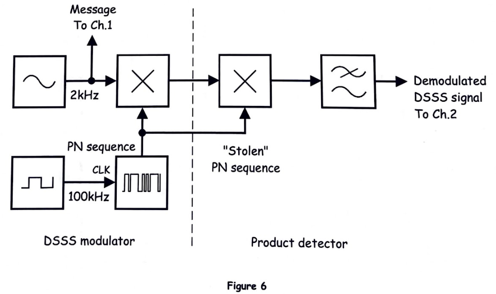  

#### Output Observations
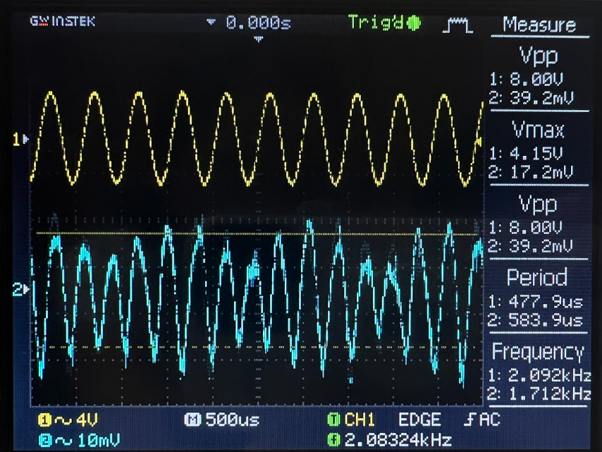  

---

# PART D – DSSS and Deliberate Interference (Jamming)

### Variable Frequency Jamming Block Diagram
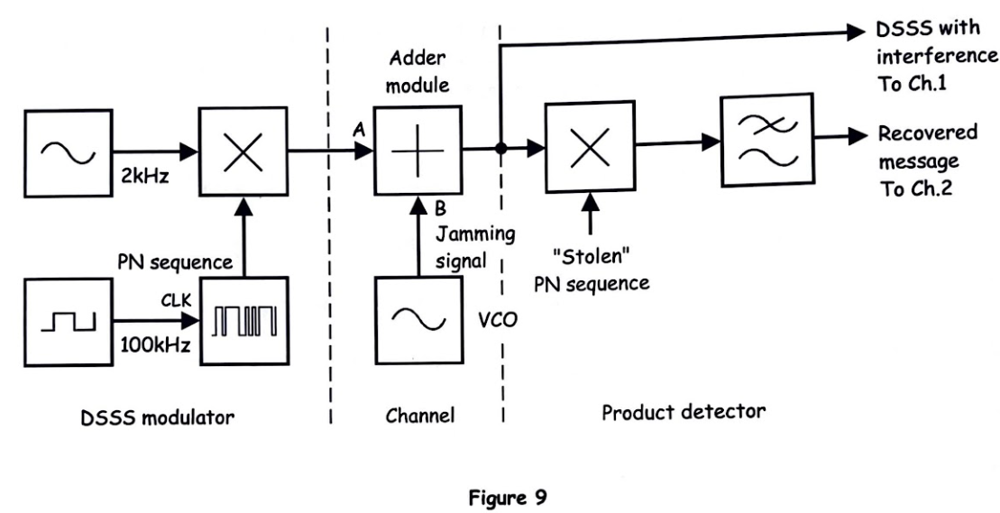  

#### Output Observations
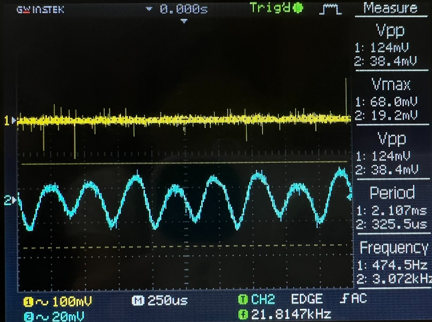  
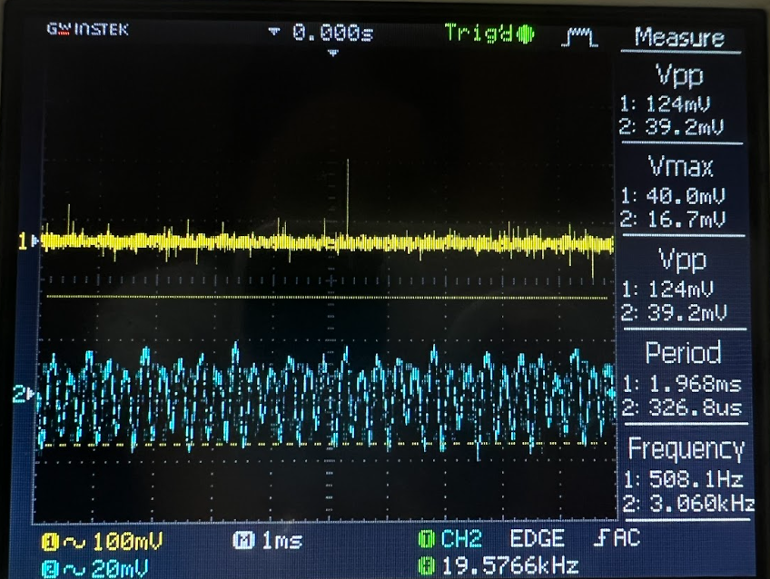  
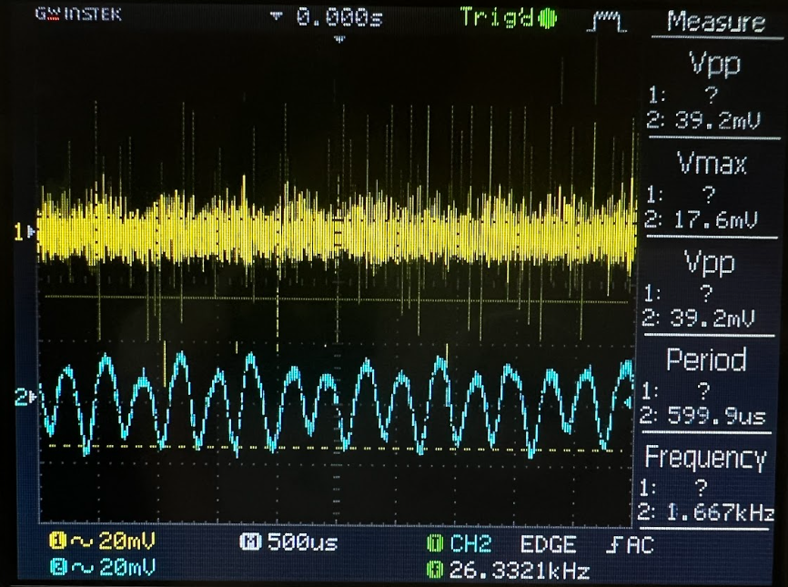  

**Question:**  
*Why doesn’t the jamming signal interfere with the recovery of the message?*  
**Answer:** DSSS spreads the message across a wide bandwidth. The **narrowband jamming signal only affects a small portion of the spectrum**, and the product detector uses the correct PN code to despread the signal, effectively recovering the original message while rejecting the interference.

---

# Conclusion
- DSSS spreads a narrowband signal into a **wideband signal**, improving resistance to interference and intentional jamming.  
- Proper synchronization of the PN code is critical for **message recovery** using a product detector.  
- This experiment demonstrates the fundamental principle behind **spread-spectrum communication** used in Wi-Fi, GPS, and secure military communications.
