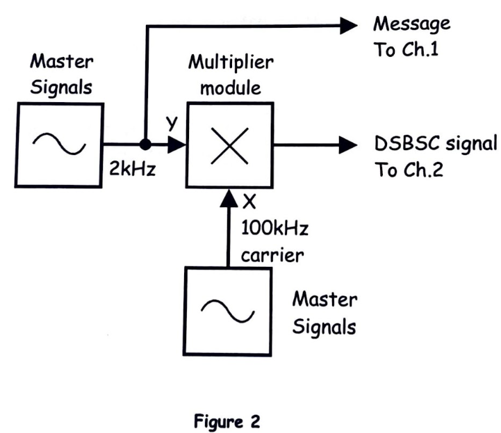
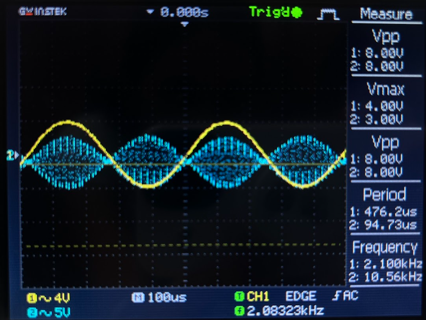
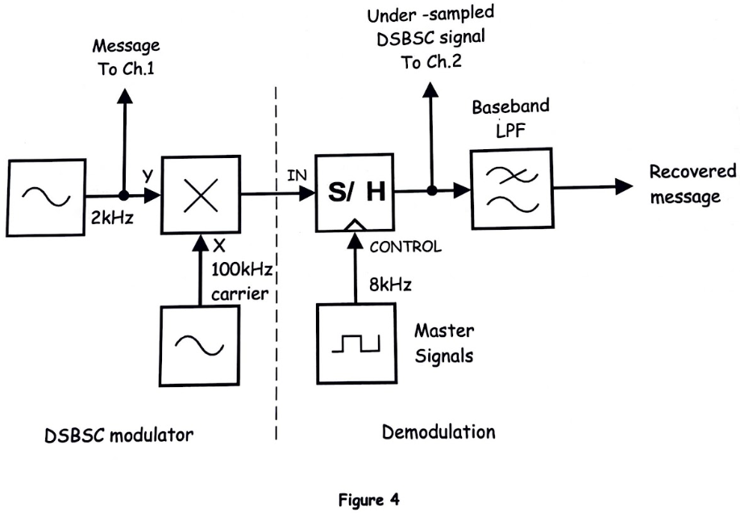
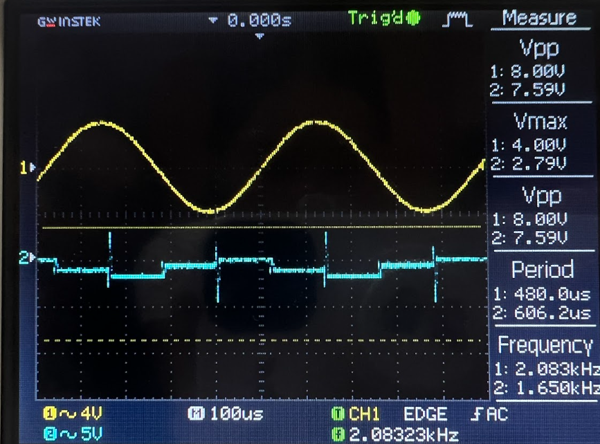
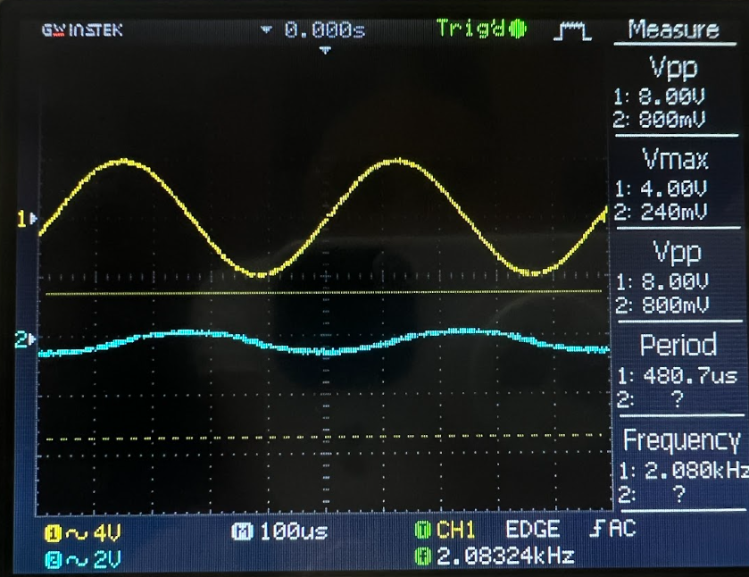
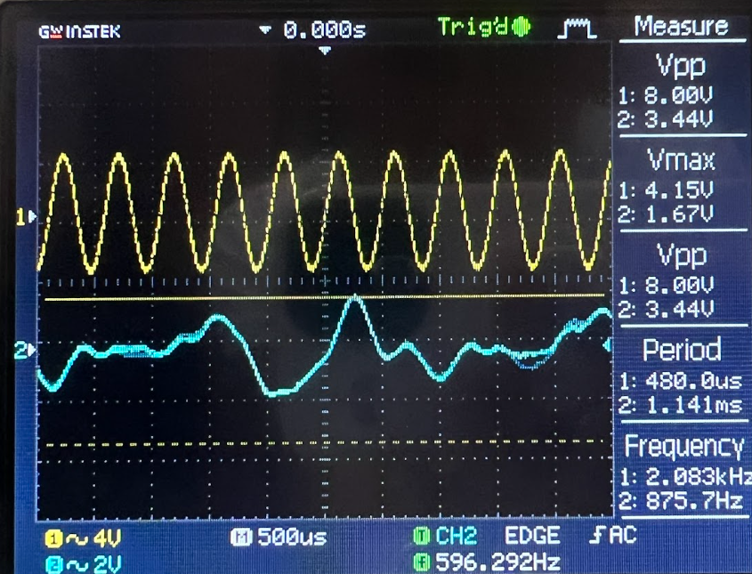

# EXPERIMENT 20 – Undersampling in SDR (Software Defined Radio)

## Objectives
This experiment demonstrates **undersampling** as applied in **Software Defined Radio (SDR)**. Undersampling allows a high-frequency signal to be sampled at a rate lower than the Nyquist rate, intentionally creating aliasing to bring the signal down to baseband. Students will observe a **DSBSC signal**, perform direct down-conversion using undersampling, and explore the challenges of synchronization in SDR.

---

# Equipment
- Emona Telecoms-Trainer 101 (plus-power pack)  
- Dual-channel 20 MHz oscilloscope  
- Two Emona Telecoms-Trainer 101 oscilloscope leads  
- Assorted Emona Telecoms-Trainer 101 patch leads  

---

# PART A – Setting up a Bandwidth-limited Signal

### Bandwidth-limited Signal Block Diagram
  
*Figure 1: Setting up a bandwidth-limited signal.*

### Output Observation
  

**Questions:**  
1. *For the given inputs to the Multiplier module, what are the frequencies of the two sinewaves that make up the DSBSC signal?*  
   **Answer:** The two sinewaves correspond to the **upper and lower sidebands** of the modulated signal, calculated as \( f_c \pm f_m \), where \( f_c \) is the carrier frequency and \( f_m \) is the message frequency.  

2. *What’s the bandwidth of the DSBSC signal?*  
   **Answer:** The bandwidth equals \( 2f_m \), covering the range of the upper and lower sidebands.

---

# PART B – Direct Down-conversion Using Undersampling

### Direct Down-conversion Block Diagram
  
*Figure 2: Down-conversion using undersampling.*

### Output Observation
  
  

**Questions:**  
1. *What’s the significance of the signal on the Baseband LPF’s output?*  
   **Answer:** The low-pass filter (LPF) output represents the **aliased baseband signal** produced by undersampling. This shows how the high-frequency DSBSC signal is effectively brought down to a lower frequency range without traditional demodulation.  

2. *Given the sampling frequency is 8.333 kHz (rounded from 8 kHz), which harmonic in the sampling signals is demodulating the DSBSC signal?*  
   **Answer:** The aliased harmonic that falls within the **Nyquist band** of the undersampled system is responsible. Specifically, the integer multiple of the sampling frequency that overlaps with the original carrier frequency effectively performs down-conversion.

---

# PART C – Synchronization

### Output Observation
  

**Question:**  
*Why doesn’t this solve the problem and allow the demodulator to recover the message?*  
**Answer:** Undersampling without proper **phase and timing synchronization** can lead to misalignment of the aliased signal and baseband LPF. The resulting signal may have **distortion or partial recovery**, highlighting that successful SDR demodulation requires both frequency alignment and precise timing with the sampling clock.

---

# Conclusion
- Undersampling allows **direct down-conversion** of high-frequency signals without a traditional mixer.  
- Proper **synchronization** is critical for recovering the original message in SDR systems.  
- Observing outputs on the oscilloscope helps visualize **aliasing, baseband signals, and DSBSC sidebands**.  
- This technique is widely applied in **SDR and digital communications** where hardware complexity is reduced by sampling at sub-Nyquist rates.
